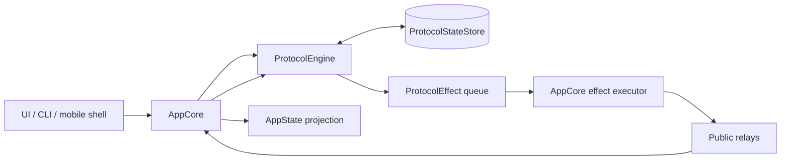
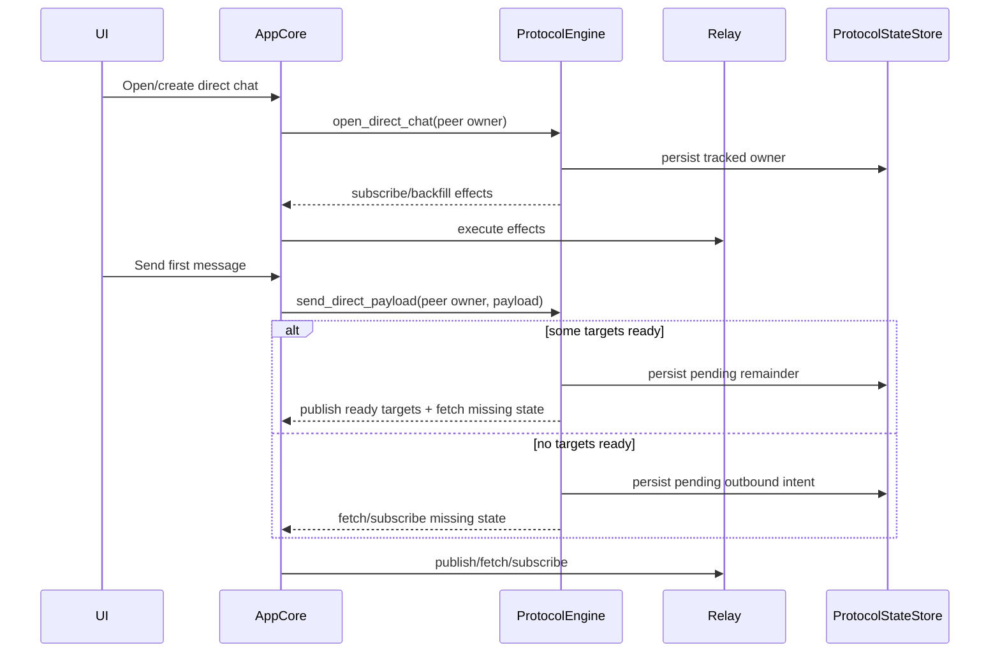
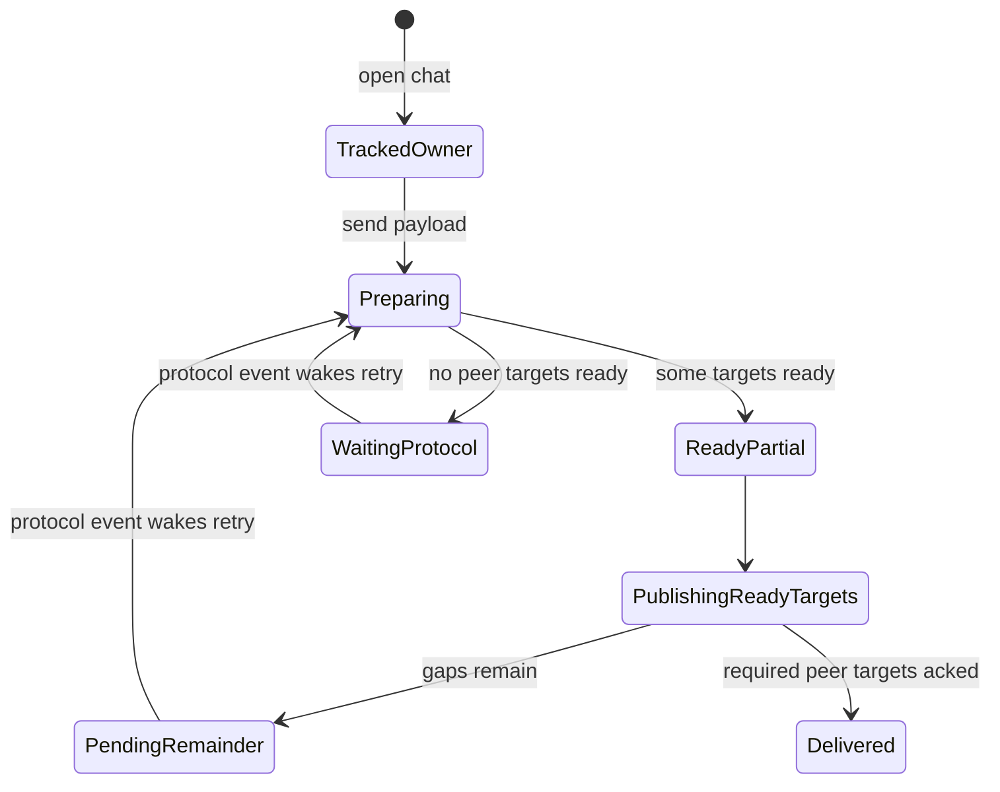
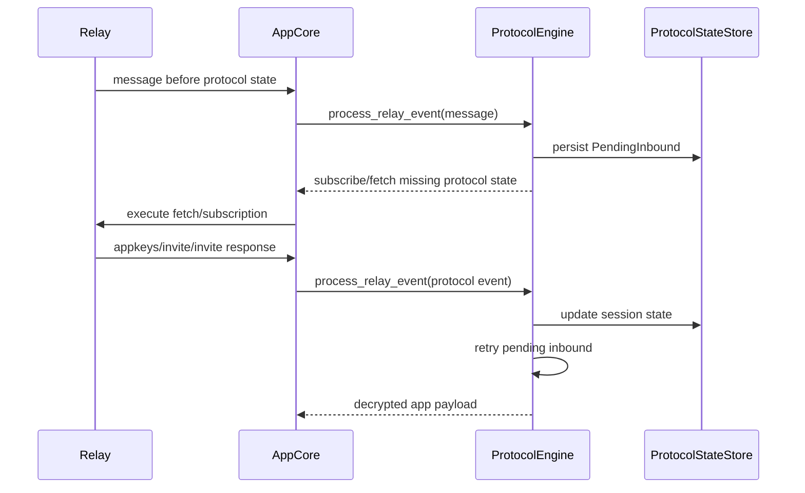
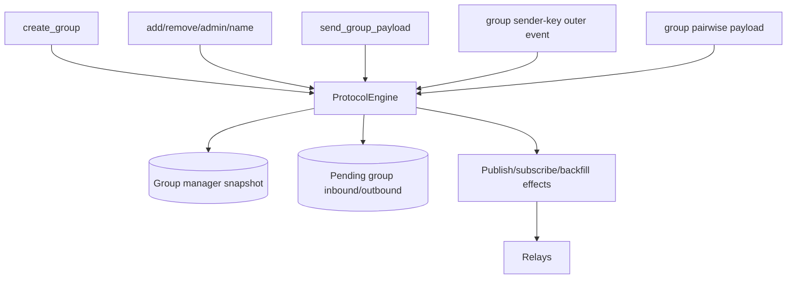
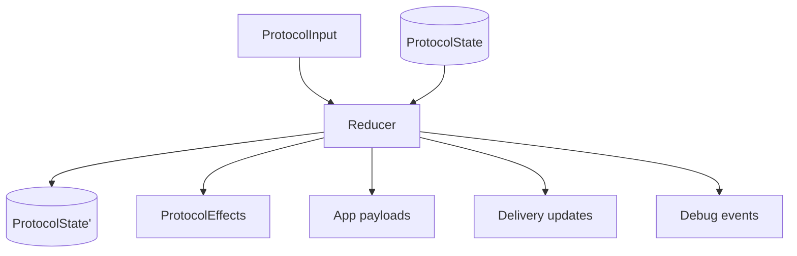

# AppCore Protocol Simplification Design

Date: 2026-05-06

This design proposes a concrete change to move this app closer to the
experimental-chat architecture while retaining this app's current features and
wire compatibility.

The design keeps `ProtocolEngine` as a module, but changes its role: it becomes
the single protocol state machine. AppCore executes effects and projects state,
but does not independently own protocol progress.

## Problem

The current migration moved much direct/group protocol ownership into
`ProtocolEngine`, but AppCore still owns important pieces of protocol progress:

- queued target interpretation
- one-shot protocol fetch orchestration
- protocol subscription runtime
- relay publish ack metadata
- delivery trace reconciliation
- busy/sync completion tracking
- app-key cache and import timing

This creates a split-brain protocol model. Fresh-chat failures have appeared
when a protocol state transition happened in one layer but did not wake or
complete work in another layer.

The architectural smell is that network sync counts can become necessary for
correctness. They should not be. Durable protocol state should decide whether a
message is pending, ready, delivered, or waiting for protocol state.

## Goals

- Make protocol progress deterministic and durable.
- Make receiver-side event ordering robust.
- Keep current NDR/app-key/invite/message wire compatibility.
- Preserve direct messages, groups, reactions, receipts, typing, disappearing
  settings, attachments, mobile push preview, nearby, and profile behavior.
- Keep legacy runtime storage intact during the trial.
- Avoid `NdrRuntime` in AppCore hot paths.
- Remove AppCore-level queued target state as protocol truth.
- Treat busy flags as UI/CLI hints only.

## Non-Goals

- Do not change the public wire format.
- Do not delete legacy runtime storage.
- Do not rewrite the native shells.
- Do not make scripts the source of truth for public relay validation.
- Do not remove observability. Simplification should reduce ownership
  ambiguity, not hide useful diagnostics.

## Target Architecture



The key invariant:

> AppCore may execute protocol effects, but only ProtocolEngine decides protocol
> state transitions.

## Component Responsibilities

### AppCore

Owns application shell behavior:

- process lifecycle
- FFI/native action dispatch
- app-level persistence orchestration
- relay client lifecycle
- executing protocol effects
- UI-facing `AppState` projection
- toast/error projection
- delivery trace projection
- chat thread rendering state
- native feature bridges

AppCore must not own:

- whether a protocol target is logically pending
- whether a missing roster/device/session should be retried
- which protocol filters are required for pending work
- whether pending inbound can be forgotten
- direct/group protocol state transitions

### ProtocolEngine

Owns protocol state and state transitions:

- session manager snapshot
- group manager snapshot
- tracked owners/chats
- known app-key/roster timestamps
- known message authors
- known invite authors
- known group sender-key authors
- pending direct outbound
- pending group outbound
- pending direct inbound
- pending group inbound
- retry deadlines
- subscription generation
- backfill cursors and last-attempt timestamps
- debug snapshots

ProtocolEngine exposes deterministic reducer-style APIs:

- `account_started`
- `open_direct_chat`
- `open_group_chat`
- `send_direct_payload`
- `send_group_payload`
- `process_relay_event`
- `process_publish_ack`
- `retry_pending_protocol`
- `foreground_tick`
- `relay_reconnected`
- `manual_backfill_requested`
- `subscription_inputs`
- `debug_snapshot`

Each API returns:

- updated durable state
- protocol effects
- app payloads to apply
- delivery/status updates
- debug events

### ProtocolStateStore

Owns durable protocol persistence for engine state.

Stored data should include:

- `SessionManagerSnapshot`
- `GroupManagerSnapshot`
- tracked owners/chats
- known app-key metadata
- known invite metadata
- known message-author metadata
- pending outbound direct and group work
- pending inbound direct and group work
- publish metadata needed for ack correlation
- retry/backfill timestamps
- subscription generation/debug counters

Legacy runtime storage remains read-only or import-only during this trial.

### ProtocolEffect

The effect surface must be complete enough that AppCore does not need protocol
knowledge to execute it.

Effects:

- publish signed event
- publish unsigned event after signing
- publish staged first-contact event
- subscribe protocol filters
- unsubscribe protocol filters
- request protocol backfill
- request recent message backfill for owner
- emit decrypted app payload
- emit delivery status update
- emit debug snapshot/log

Publish effects must include:

- outer event id, when known
- inner event id, when known
- target owner pubkey, when known
- target device pubkey, when known
- channel/purpose
- first-contact/bootstrap marker, when applicable

### Relay Effect Executor

Lives in AppCore.

Responsibilities:

- ensure relays are configured
- execute subscriptions
- execute fetches
- execute publishes
- report publish ack/failure back to `ProtocolEngine`
- feed relay events back to `ProtocolEngine`

It does not infer missing protocol state. It only executes effects.

### Subscription Planner

Lives inside `ProtocolEngine`.

Inputs:

- local owner/device
- tracked peer owners
- pending outbound missing owners/devices
- pending inbound unresolved sender claims
- known app-key/roster owners
- known invite authors
- known message authors
- known group sender-key authors
- invite-response recipients
- cold-start backfill needs

Outputs:

- stable subscription generation
- protocol filters
- backfill filters
- reason/debug labels

### Delivery Trace Projector

AppCore can own the user-facing projection, but the protocol state must provide
the facts.

Facts:

- pending target owner/device
- published target owner/device
- acked target owner/device
- failed target owner/device
- still missing protocol state

Rules:

- local sibling acks update only local sibling delivery.
- peer delivery becomes sent only after an ack for the peer owner/device.
- a message remains pending if any required peer target is still missing,
  queued, or unacked.

### Mobile Push Preview

Mobile push preview uses a read-only engine load path.

Rules:

- load protocol snapshots read-only
- decrypt with an overlay/clone of session state
- do not persist ratchet changes
- do not mutate pending queues
- emit only preview result

### Payload Features

These remain app-level payloads carried by the protocol engine.

| Feature | Protocol responsibility | AppCore responsibility |
| --- | --- | --- |
| Text | Encrypt/fanout/decrypt payload | Thread/message projection |
| Reactions | Transport payload | Reaction state projection |
| Receipts | Transport payload | Read/delivery UI projection |
| Typing | Transport payload | Typing TTL/floor state |
| Disappearing settings | Transport payload | Message expiry policy/projection |
| Attachments | Transport text with hashtree links | Upload/render attachment metadata |
| Nearby | Existing publish pipeline | Nearby UI/platform behavior |

## Fresh Direct Chat Flow



The first message is never considered complete just because a local sibling
publish succeeded.



## Receiver Ordering Flow

Receiver correctness must not depend on relay publish order.



Pending inbound is removed only after the decrypted payload has been applied or
the engine has classified the event as permanently invalid.

## Group Flow

Group handling follows the same reducer model.



Group invariants:

- sender identity is owner identity, not device identity
- device pubkeys are transport endpoints
- member/admin checks use owner pubkeys
- removed members do not receive future group payloads
- sender-key outer before metadata is queued and retried
- metadata before sender-key is queued and retried

## Event Model

All protocol work should be represented as input events to the engine.

Inputs:

- account start
- restored state loaded
- open direct chat
- open group chat
- direct send
- group send
- relay event
- publish ack
- publish failure
- foreground tick
- relay reconnect
- manual backfill
- timer retry

Outputs:

- updated protocol state
- protocol effects
- decrypted app payloads
- delivery updates
- debug logs



## Persistence Model

Persist after each state-changing engine operation that:

- changes session/group snapshots
- adds/removes pending inbound
- adds/removes pending outbound
- changes retry/backfill timestamps
- changes subscription generation
- changes publish ack state

The engine may batch persistence internally, but AppCore should not observe an
effect that depends on state which has not been durably recorded.

## Simplification Rules

These rules keep the architecture close to experimental-chat.

1. Do not use network sync counts to decide message correctness.
2. Do not store queued target strings as the source of truth.
3. Do not let AppCore infer missing protocol state from effect shape.
4. Do not suppress a relay message permanently before it is applied.
5. Do not mark peer delivery sent from local sibling acks.
6. Do not retry by rebuilding state in AppCore. Retry inside the engine.
7. Do not make subscriptions imperative. Derive them from state.
8. Do not special-case feature payloads outside the direct/group protocol path.

## Proposed API Shape

```rust
pub enum ProtocolInput {
    AccountStarted(AccountStarted),
    OpenDirectChat { owner: PublicKey },
    SendDirectPayload { owner: PublicKey, chat_id: String, payload: AppPayload },
    SendGroupPayload { group_id: String, payload: AppPayload },
    RelayEvent(Event),
    PublishAck { event_id: String, relay_url: String },
    PublishFailed { event_id: String, relay_url: String, error: String },
    ForegroundTick { now_secs: u64 },
    RelayReconnected { now_secs: u64 },
    ManualBackfill { reason: String },
}

pub struct ProtocolOutput {
    pub effects: Vec<ProtocolEffect>,
    pub app_payloads: Vec<DecryptedAppPayload>,
    pub delivery_updates: Vec<ProtocolDeliveryUpdate>,
    pub debug_events: Vec<ProtocolDebugEvent>,
}
```

The exact Rust types can differ. The important part is that every state
transition has the same shape:

```text
input + durable protocol state -> new durable protocol state + effects
```

## Migration Plan

### Phase 1: Define Ownership Boundary

- Document `ProtocolEngine` as the only protocol state owner.
- Move subscription/backfill inputs into engine state.
- Stop treating queued target diagnostics as fetch source of truth.
- Keep current effects working during the transition.

### Phase 2: Direct Chat Parity

- Store pending direct outbound as app intent plus protocol gaps.
- Publish ready targets immediately.
- Keep missing remote owner/device work pending even when local sibling publish
  succeeds.
- Retry pending direct outbound on every app-key, invite, invite-response,
  message-author, relay reconnect, and foreground tick.
- Store pending direct inbound before remembering a relay message as applied.

### Phase 3: Subscription And Backfill Derivation

- Engine exposes `subscription_inputs`.
- Engine exposes `recent_backfill_filters`.
- AppCore only executes subscribe/fetch effects.
- Remove AppCore-specific queued protocol target fetch decisions.
- Make `SyncComplete` cosmetic.

### Phase 4: Group Parity

- Move group create/name/member/admin/send fully through engine.
- Persist pending group outbound and inbound in engine state.
- Retry group sender-key and metadata ordering permutations.
- Ensure owner/device identity separation for group membership.

### Phase 5: Auxiliary Payload Parity

- Route receipts, reactions, typing, disappearing settings, and attachments
  through the same direct/group payload APIs.
- Keep AppCore projection logic for each feature.
- Ensure feature tests assert transport behavior through engine paths.

### Phase 6: Push Preview And Legacy Import

- Add read-only engine load for mobile push preview.
- Ensure preview decrypt cannot persist ratchet mutation.
- Keep legacy runtime storage import/read-only compatibility.

### Phase 7: Remove Remaining Hot-Path Runtime/Fallback Ownership

- Remove `NdrRuntime` and `setup_user` from AppCore hot paths.
- Remove AppCore protocol retry/fetch state that duplicates engine state.
- Keep debug snapshots for pending counts, missing reasons, and subscriptions.

## Test Strategy

### Unit Tests

- fresh direct send with only local sibling ready remains peer-pending
- retry before peer discovery does not drop pending outbound
- app-key event wakes pending outbound retry
- invite event wakes pending outbound retry
- invite response event wakes pending outbound retry
- message before protocol state persists pending inbound
- duplicate relay event is idempotent
- publish ack for local sibling does not mark peer sent
- publish ack for peer owner/device marks only that target sent
- group sender-key before metadata queues and retries
- group metadata before sender-key queues and retries
- removed group member does not receive future payloads
- mobile push preview decrypt does not mutate persisted ratchet state

### Integration Tests

- CLI multi-device fresh direct chat over public relays
- iOS simulator to Android emulator fresh chat
- Android emulator to iOS simulator fresh chat
- restored owner with late-linked sibling
- group create/add/remove/admin/send from every device
- receipts/reactions/typing/disappearing/attachments over migrated path

### Manual Validation

- public relays only
- disposable iOS simulators and Android emulators
- long-running direct chat with restarts and reconnects
- new-chat storm with late-online devices
- Alice with at least three devices
- group membership isolation after remove
- push preview where supported

## Acceptance Criteria

- AppCore hot paths do not use `NdrRuntime`, `ndr_runtime`, `setup_user`, or
  runtime fallback protocol ownership.
- Direct and group send/receive/subscription/backfill are engine-owned.
- Receiver handles message-before-protocol-state ordering.
- Ready targets receive immediately while missing targets stay pending.
- Local sibling ack never marks peer recipient sent.
- No protocol pending work is represented only by AppCore queued strings.
- `SyncComplete` and network busy counts are not protocol correctness gates.
- Legacy runtime storage remains intact during the trial.
- Public relay manual validation passes before the migration is considered
  complete.

## Risks

| Risk | Mitigation |
| --- | --- |
| Engine API becomes too broad | Keep APIs event-like and reducer-shaped. |
| AppCore still infers protocol state from effects | Make effects explicit and include owner/device metadata. |
| Delivery trace diverges from engine state | Treat engine/publish metadata as trace facts; AppCore only projects them. |
| Subscription derivation misses a source | Add snapshot tests for subscription inputs from pending/direct/group states. |
| Push preview mutates ratchets | Use cloned read-only snapshots and tests that persisted state is unchanged. |
| Group owner/device confusion returns | Add owner/device identity tests for every group receive path. |

## Open Questions

- Should pending relay publish metadata live inside `ProtocolEngine`, or should
  AppCore keep it as effect-execution state and report acks back to the engine?
- Should `ProtocolEngine` persist directly through `AppStore`, or should AppCore
  persist engine snapshots after each output?
- How much of delivery trace should become engine-owned versus AppCore
  projection-owned?
- Should app-key cache remain in AppCore for UI/debug projection, or become an
  engine debug projection only?

The recommended starting answer is conservative: keep relay execution and
UI-facing projection in AppCore, but move all protocol state facts into
`ProtocolEngine`.

