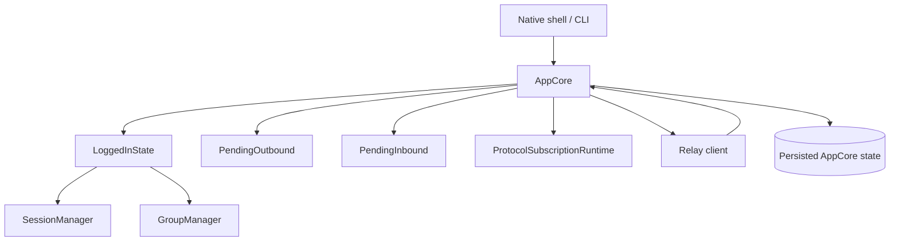
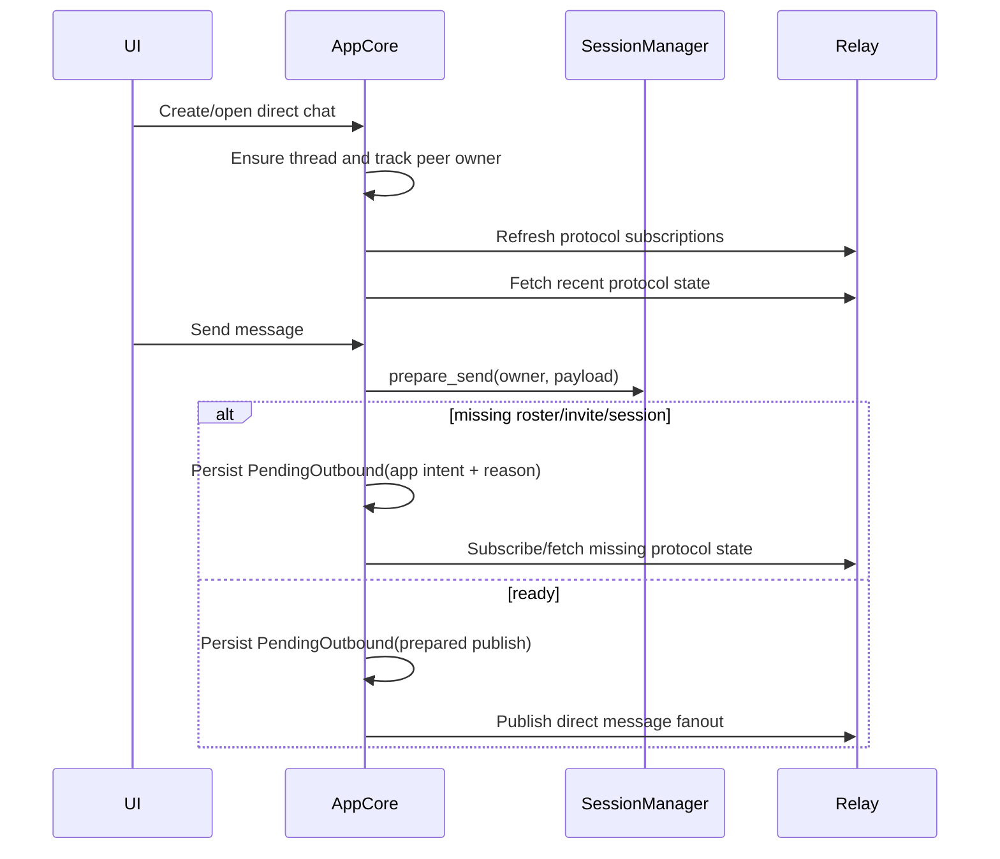
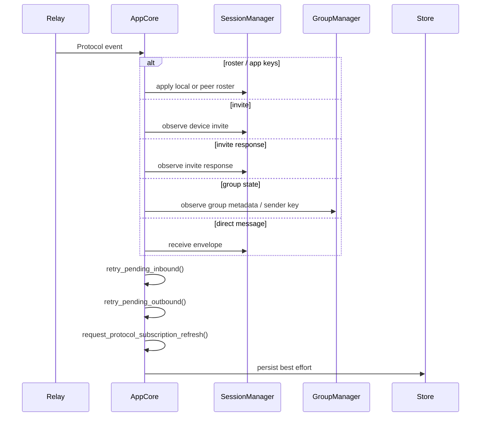
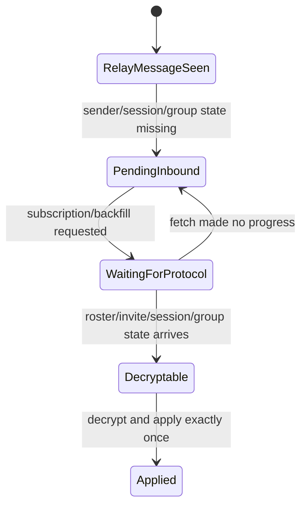
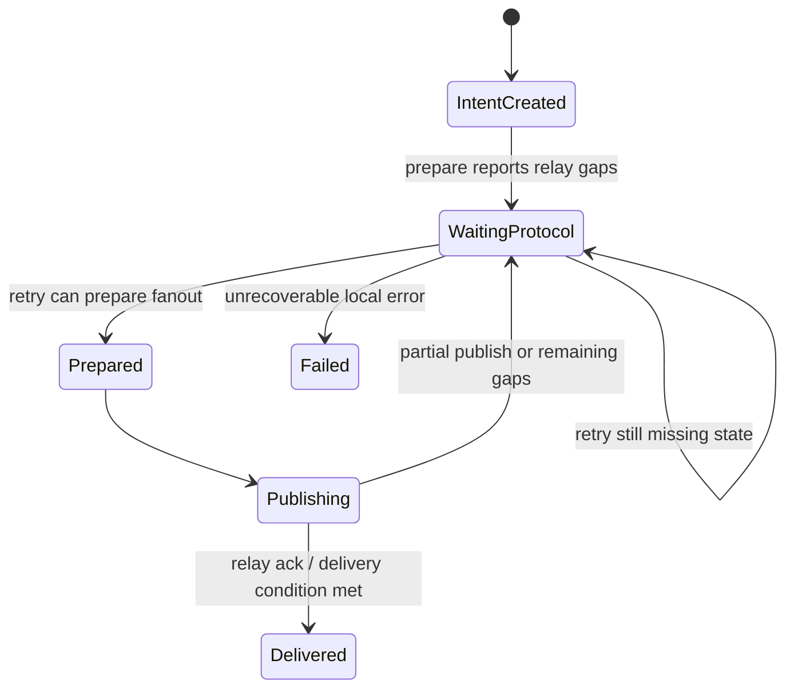
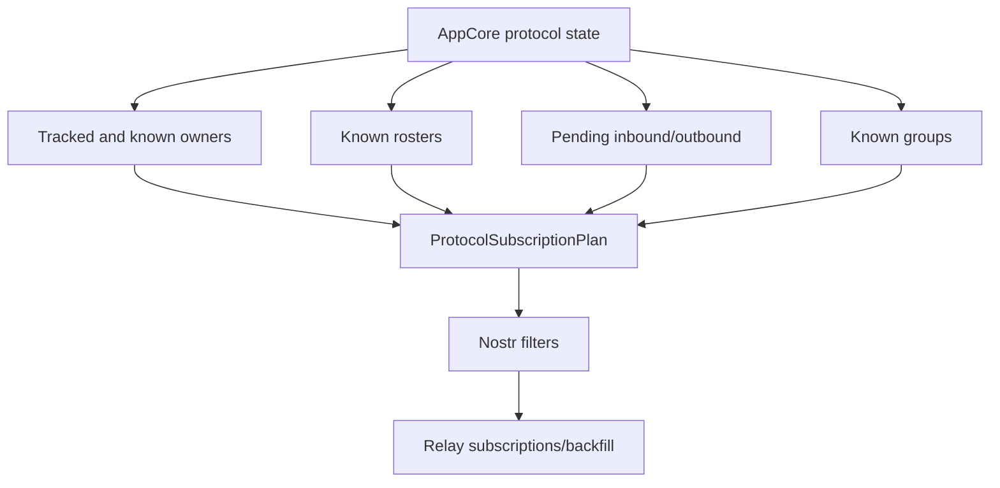
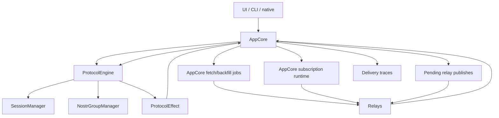
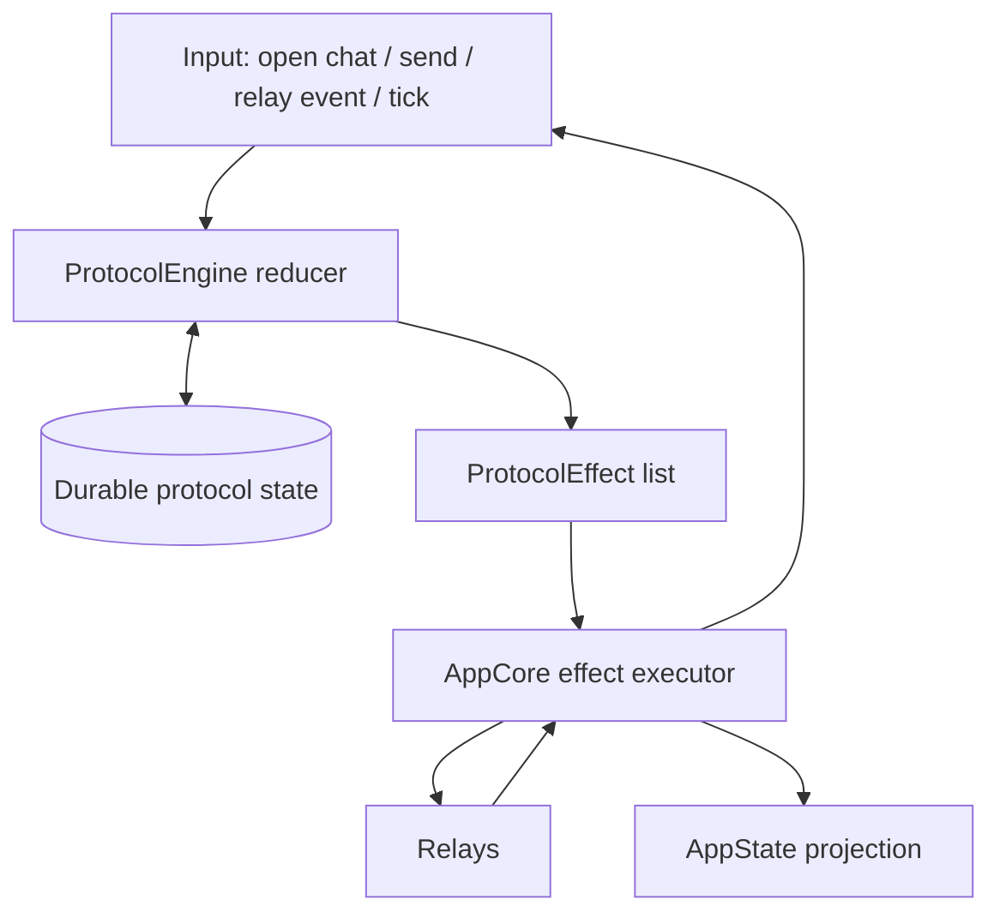

# Experimental-Chat Protocol Architecture Analysis

Date: 2026-05-06

This document records the static architecture of the `iris-fork/experimental-chat`
implementation and explains how the same architecture could be applied to this
app without losing current product behavior.

The focus is protocol ownership: direct chats, group chats, pending sends,
pending receives, subscription planning, relay catch-up, and durable state.

## Source Map

Experimental-chat was inspected primarily in:

- `iris-fork/experimental-chat/iris-chat-rs/core/src/core.rs`
- `iris-fork/experimental-chat/nostr-double-ratchet`

This app was compared against:

- `core/src/core.rs`
- `core/src/core/chats.rs`
- `core/src/core/groups.rs`
- `core/src/core/protocol.rs`
- `core/src/core/protocol_engine.rs`
- `core/src/core/relay.rs`
- `core/src/core/mobile_push.rs`
- `nostr-double-ratchet`

## Executive Summary

Experimental-chat is simpler because AppCore owns the protocol state directly.
It does not split protocol progress across an AppCore fetch layer, an AppCore
queued-target layer, and a protocol-engine pending layer.

It still has state. The important difference is where that state lives and what
it means.

Experimental-chat state is mostly logical protocol state:

- known session state
- known group state
- pending outbound app intents
- pending inbound relay events or decrypted payloads
- protocol subscription refresh state
- publish in-flight state

This app currently has a more layered shape:

- `ProtocolEngine` owns sessions, groups, pending inbound, and pending outbound
- AppCore owns relay fetch jobs, protocol subscription runtime, relay publish
  metadata, delivery traces, busy flags, app-key cache, and queued target
  handling
- effects flow from engine to AppCore, then AppCore decides what fetches,
  subscriptions, delivery updates, and retries happen next

The current split is the reason counts and busy flags have started to look like
protocol correctness machinery. In experimental-chat, similar flags exist for
UI/network activity, but correctness comes from durable pending state and event
wakeups.

## Experimental-Chat Component Responsibilities

| Component | Responsibility |
| --- | --- |
| Native shell | Render AppState and send user actions. It does not own protocol rules. |
| AppCore | Owns app state, relay event interpretation, pending queues, subscriptions, retries, persistence, and UI projection. |
| LoggedInState | Holds owner/device identity, relay client, authorization state, `SessionManager`, and `GroupManager`. |
| SessionManager | Owns direct-message protocol state, rosters, device invites, invite responses, ratchets, and direct prepare/receive. |
| GroupManager | Owns group metadata, sender keys, membership, admin state, group fanout preparation, and group receive state. |
| PendingOutbound | Durable app intent or prepared publish waiting for protocol state, relay ack, or retry. |
| PendingInbound | Durable relay event or decrypted payload waiting for missing sender/session/group state. |
| ProtocolSubscriptionRuntime | Tracks the currently applied subscription plan and dirty refresh state. |
| Relay client | Executes subscriptions, fetches, publishes, and returns relay events into AppCore. |
| Persistence | Stores AppCore protocol snapshots and pending queues so process restart does not lose protocol work. |

## Experimental-Chat Fresh Direct Chat Flow

Starting a new direct chat in experimental-chat is not a special runtime setup
operation. It is mostly:

1. Normalize the peer owner.
2. Ensure a thread record exists.
3. Track the peer as protocol-relevant.
4. Republish local identity artifacts.
5. Refresh protocol subscriptions.
6. Schedule catch-up for tracked peers.
7. On send, ask `SessionManager` to prepare the direct payload.
8. If protocol state is missing, persist pending outbound and fetch/subscribe
   for the missing protocol state.
9. If protocol state is ready, persist a publish record and publish.

The key point is that the pending outbound is the durable truth. A fetch is only
an effect that may help satisfy it.

## Experimental-Chat Relay Event Flow

Relay events are interpreted directly by AppCore and applied to the managers.
After every protocol-relevant event, AppCore retries pending work immediately.

Protocol events include:

- owner roster/app-key equivalent events
- device invites
- invite responses
- direct message envelopes
- group sender-key outer events
- group pairwise payloads

This makes relay ordering naturally tolerant. If message data arrives before the
protocol state required to decrypt it, the event is queued as pending inbound.
When the missing protocol event later arrives, that event wakes the retry.

## Experimental-Chat Pending Outbound Model

Pending outbound stores app intent first. For direct messages that is the chat
id, message id, body, retry deadline, reason, and optionally a prepared publish
batch.

The retry loop does not depend on a network sync being "complete". It simply
retries pending work when:

- a protocol event arrives
- a retry timer fires
- foreground/liveness events run
- subscriptions are refreshed
- relay reconnect/catch-up runs

## Experimental-Chat Subscription Model

Experimental-chat derives subscriptions from AppCore protocol state. It does not
use ad-hoc queued target strings as the primary source of truth.

Subscription inputs include:

- local owner
- tracked peer owners
- owners known from pending work
- roster/app-key authors
- invite authors discovered from known rosters
- invite-response recipient
- known message authors
- group sender-key authors

`ProtocolSubscriptionRuntime` tracks whether the active plan needs refreshing,
but the plan itself is derived from durable state.

## Why It Works Well

Experimental-chat works well because it has one protocol truth boundary.

Important properties:

- `SessionManager` and `GroupManager` are mutated where relay events are
  interpreted.
- Pending inbound and outbound live beside those managers.
- Every protocol event is also a retry trigger.
- Missing state is represented as durable pending work, not as an implicit
  assumption that a fetch will complete soon.
- Subscription filters are derived from state.
- Busy flags are user-visible progress hints, not protocol state-machine gates.

## Current App Component Split

The current app has a Rust-first architecture and already moved much protocol
state into `ProtocolEngine`, but it still splits responsibilities across
several layers.

| Component | Current responsibility |
| --- | --- |
| AppCore | Owns app state, UI projection, relay client, relay fetches, subscription runtime, pending relay publishes, delivery trace, app-key cache, and effect execution. |
| ProtocolEngine | Owns session manager, group manager, pending direct inbound, pending direct outbound, group protocol state, and protocol effects. |
| AppCore protocol helpers | Derive current filters, queued target filters, catch-up fetches, liveness retries, and sync/busy state. |
| Relay effect executor | Converts `ProtocolEffect` into signed publishes, relay subscriptions, fetches, and decrypted app payloads. |
| Pending relay publish store | Tracks publish event ids, inner event ids, owner/device metadata, and ack state. |
| Delivery trace logic | Converts publish ack metadata and engine queued diagnostics into user-visible delivery state. |

This split is workable, but it is more fragile. A single fresh send can require:

1. `ProtocolEngine` to detect missing remote owner/device state.
2. AppCore to preserve the pending outbound.
3. AppCore to interpret queued diagnostics.
4. AppCore to fetch queued protocol targets.
5. Relay events to re-enter AppCore.
6. AppCore to feed them into `ProtocolEngine`.
7. `ProtocolEngine` to wake pending work.
8. AppCore to execute new publish effects.
9. Delivery trace to avoid mistaking local sibling acks for peer delivery.

Each step is reasonable by itself. The failure mode is missed wakeups and
ambiguous ownership.

## Applying Experimental-Chat Architecture Here

This app does not need to literally copy experimental-chat's monolithic
`core.rs`. The useful idea is not file layout. The useful idea is one protocol
state owner.

There are two viable shapes.

### Shape A: Inline Protocol State Into AppCore

This is closest to experimental-chat.

AppCore would directly own:

- `SessionManager`
- `NostrGroupManager`
- pending direct outbound
- pending group outbound/control work
- pending direct inbound
- pending group inbound
- subscription state
- protocol state persistence

Pros:

- Fewer layers.
- Wakeups are direct.
- Very close to the proven experimental-chat flow.

Cons:

- AppCore is already broad in this app.
- Mobile push preview and tests may be cleaner with a separable engine module.
- The migration would touch more files and make AppCore heavier.

### Shape B: Keep ProtocolEngine, But Make It The Single Protocol Owner

This keeps the current modular direction while adopting the experimental-chat
state model internally.

`ProtocolEngine` would own:

- all direct and group protocol state
- all pending inbound and outbound protocol work
- tracked owners/chats
- known app-key/roster/invite/message-author state
- subscription/backfill inputs
- retry deadlines and liveness needs
- debug snapshots

AppCore would own:

- UI state and persistence orchestration
- relay client lifecycle
- execution of engine effects
- delivery trace projection from engine/publish metadata
- native-facing `AppState`

Pros:

- Keeps a clean module boundary.
- Allows mobile push preview to load a read-only engine.
- Avoids expanding AppCore with more protocol internals.
- Still gets the experimental-chat property: one protocol state machine.

Cons:

- Requires discipline: AppCore must stop inventing protocol truth outside the
  engine.
- Effect APIs must be expressive enough for publish, subscribe, backfill, and
  decrypted payload emission.

## Features That Must Be Preserved

The current app has more product surface than experimental-chat, but these do
not require a more complex correctness model.

| Feature | Required handling in simplified architecture |
| --- | --- |
| Direct messages | Engine-owned pending outbound/inbound and direct receive. |
| Groups | Engine-owned group metadata, sender keys, member/admin changes, pending group fanout, pending group inbound. |
| Reactions | App payload over direct/group send path. |
| Receipts | App payload over direct/group send path with delivery trace projection. |
| Typing | App payload over direct/group send path with TTL/floor logic in AppCore. |
| Disappearing settings | App payload/state mutation over same protocol path. |
| Attachments | Text payloads containing hashtree links continue through migrated send path. |
| Mobile push preview | Read-only engine load/decrypt overlay that cannot persist ratchet mutation. |
| Nearby | Existing AppCore publish pipeline can remain; protocol events still flow through the engine. |
| Legacy runtime storage | One-time import or read-only preview source; do not delete during trial. |
| Delivery trace | Needs target owner/device metadata on publish effects and ack handling. |

## Simplification Opportunities

The architecture can be simplified without losing features by applying these
rules:

1. Durable pending work is the source of truth, not queued target strings.
2. Relay events are wakeups. Every protocol event should retry pending protocol
   work.
3. Subscription/backfill filters are derived from durable protocol state.
4. Fetch completion should not decide protocol correctness.
5. Busy flags are UI/CLI progress hints only.
6. Publish ack handling updates exactly the target owner/device represented by
   the ack metadata.
7. Local sibling publish success does not imply remote peer delivery.
8. Receiver state must tolerate message-before-protocol-state ordering.

## Recommended Direction

Use Shape B: keep `ProtocolEngine`, but make it the single owner of protocol
state and subscription/backfill planning.

The target relationship should look like this:

In this model, AppCore still owns the app, but it no longer owns protocol
progress. It executes the protocol plan produced by the engine.

