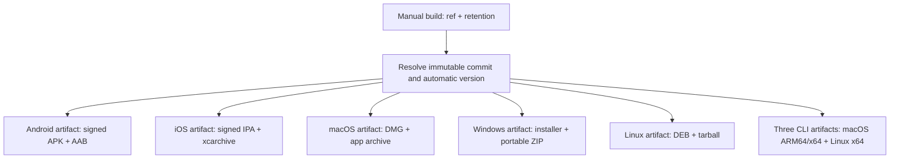

# GitHub Artifact Builds

Status: available as both a manual artifact build and the reusable build stage
of the GitHub release workflow.

## Scope

`.github/workflows/build-artifacts.yml` builds and stores:

- signed Android APK and AAB
- signed iOS IPA and zipped xcarchive
- macOS DMG and updater app archive
- unsigned Windows installer and portable ZIP, matching existing behavior
- Linux DEB and tarball
- CLI archives for macOS ARM64, macOS x64, and Linux x64

Manual runs build macOS artifacts unsigned by default. Enabling `sign_macos`
uses the protected `macos-release` environment to apply Developer ID signing,
provision the app and Share Extension, notarize the app and DMG, and validate
their Gatekeeper tickets. Tag releases always enable this mode.

The workflow never creates tags or GitHub Releases, uploads to TestFlight or an
app store, publishes to Hashtree, Zapstore, Homebrew, or crates.io, or updates a
`latest` pointer. Its repository permission is `contents: read`.

## Invocation

The manual workflow accepts:

- `ref`: branch, tag, or commit to build
- `artifact_retention_days`: 7, 30, or 90
- `sign_macos`: opt in to signed and notarized macOS artifacts

There is no version override. The metadata job resolves `ref` to one immutable
commit before any platform job starts.

## Version Contract

The selected commit is the sole source of version identity:

- version name: the semantic version from a `vX.Y.Z` tag, otherwise the
  commit's UTC date as `YYYY.M.D`
- version code: `year * 1000000 + month * 10000 + day * 100`
- build timestamp: the commit timestamp in UTC
- build SHA: the selected full commit plus its 12-character short form

For example, a commit from 2026-07-14 has version `2026.7.14` and version code
`2026071400`. Every job receives these values from the metadata job. Rebuilding
the same commit produces the same identity regardless of dispatch date.

## Workflow

### Metadata

The metadata job checks out the requested ref and exposes its commit, version,
and timestamp as job outputs. All later checkouts use the resolved commit rather
than the movable ref.

### Android

Runs on `ubuntu-24.04` using the existing `android-release` environment and
`scripts/android-release release-artifacts`. It verifies the APK with
`apksigner` and the AAB with `jarsigner` before uploading both files.

Required environment secrets:

- `IRIS_RELEASE_KEYSTORE_BASE64`
- `IRIS_RELEASE_KEYSTORE_PASSWORD`
- `IRIS_RELEASE_KEY_ALIAS`
- `IRIS_RELEASE_KEY_PASSWORD`

### iOS

Runs on `macos-15` using the existing archive/export implementation in
`scripts/ios-release`. It verifies the signed app and stores the IPA and zipped
xcarchive. It never invokes the upload or TestFlight commands.

Required secrets and variables:

- `ASC_PRIVATE_KEY_P8`, `ASC_KEY_ID`, and `ASC_ISSUER_ID`
- `IRIS_IOS_BUNDLE_ID` and `IRIS_IOS_DEVELOPMENT_TEAM`

These should be scoped to a protected `ios-build` environment.

### Windows

Runs natively on `windows-2025`. `scripts/windows-build-local.ps1` builds the
Rust DLL, generates C# UniFFI bindings, publishes the self-contained WPF app,
and packages the NSIS installer and ZIP. The existing Mac-to-Windows SSH wrapper
calls the same entrypoint for local compatibility.

### macOS

Runs on `macos-15` using `scripts/macos-build`. A normal manual run creates an
unsigned DMG and updater archive for build testing. Signed runs use the
`macos-release` environment and require:

- a Developer ID Application certificate packaged as PKCS#12
- Developer ID provisioning profiles for the app and Share Extension
- App Store Connect credentials for notarization

The workflow verifies code signatures, notarization tickets, and Gatekeeper
acceptance before uploading the files. Secret values and signing identifiers
stay in the protected environment rather than the repository.

### Linux

Runs `scripts/linux-release` on `ubuntu-24.04`, preserving the existing Docker
build environment and producing the DEB and tarball.

### CLI

One three-entry runner matrix calls `scripts/cli-release` for:

- `aarch64-apple-darwin`
- `x86_64-apple-darwin`
- `x86_64-unknown-linux-gnu`

Each archive contains `iris/iris`, `iris/install.sh`, and `iris/README.txt`.

### Artifacts

Each build job uploads its own output with `if-no-files-found: error`. The
workflow succeeds only when every retained platform job builds, verifies, and
uploads its required files. GitHub records a digest for each uploaded artifact.

## Simplicity Review

- One top-level workflow owns orchestration.
- Platform build logic stays in scripts instead of YAML.
- One metadata job owns all version decisions.
- YAML anchors reuse immutable checkout and the shared build environment.
- A matrix represents the three structurally identical CLI builds.
- Each platform uploads directly; there is no custom manifest format, artifact
  restaging, or final repackaging job.
- Existing local release publication remains separate.

## GitHub Releases

`.github/workflows/release.yml` runs on a pushed `v*` tag or can be dispatched
for an existing tag. It verifies the release notes and fast project gate, calls
this workflow for the complete platform set, attests the resulting files with
GitHub artifact attestations, and creates the GitHub Release.

The release includes the platform binaries directly and records their build
provenance with GitHub artifact attestations.

## Manual Run

1. Commit and push the workflow, then merge it to the default branch so manual
   dispatch is available.
2. Confirm `android-release`, `ios-build`, and `macos-release` contain the
   required protected settings.
3. Run **Actions → Build artifacts → Run workflow** with `ref=main`.
4. Approve protected build environments if configured.
5. Download the desired `iris-<platform>-<version>-<sha>` artifact from the
   completed workflow run.

Use `sign_macos=true` when validating the complete signed release path without
creating a tag or GitHub Release.
