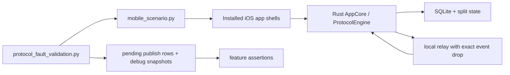

# Protocol Fault Validation

This document describes the app-shell fault-validation suite for protocol repair
features. These are not bug reproduction scripts. They intentionally inject
local relay delivery faults so we can verify repair behavior in the installed
mobile app shell.

The suite is separate from:

- Rust/AppCore unit tests, which validate protocol state transitions directly.
- CLI/local-relay tests, which validate process and persistence behavior.
- Public-relay e2e tests, which validate broad release confidence on live relays.

## Entry Point

```bash
cd /Users/l/Projects/iris/group-hardening/iris-chat-rs

scripts/protocol_fault_validation.py \
  --config scripts/scenarios/alice_alice2_bob_group.json \
  --all
```

Useful variants:

```bash
# List available app-shell fault cases.
scripts/protocol_fault_validation.py --list

# Run one case.
scripts/protocol_fault_validation.py \
  --config scripts/scenarios/alice_alice2_bob_group.json \
  --case sender_key_revision_repair

# Reuse an existing scenario state and build.
scripts/protocol_fault_validation.py \
  --config scripts/scenarios/alice_alice2_bob_group.json \
  --reuse-state \
  --skip-build \
  --case sender_key_revision_repair
```

By default the runner creates a fresh generated scenario config under the
artifact directory, adds a Carol simulator when needed by membership cases,
starts the local relay, and writes artifacts under:

```text
/tmp/iris-protocol-fault-validation-<timestamp>/
```

## What The Suite Proves



Each case answers the same questions:

- Was the intended relay fault injected?
- Did the receiver detect missing protocol state?
- Did the receiver create durable repair state when expected?
- Did the user-visible group feature still converge?
- Did successful repair clear pending repair state, or did denied repair remain
  safely invisible without leaking content?

## Cases

Default `--all` runs the first ten cases:

1. `sender_key_revision_repair`
   - Drops Bob's pairwise group metadata update.
   - Sends a sender-key group message that requires the missed revision.
   - Verifies Bob records repair state, then receives the message and group name.

2. `sender_key_distribution_repair`
   - Rotates Alice's sender key by removing a member.
   - Drops Bob's rotated sender-key distribution.
   - Verifies Bob repairs the missing key and applies the message.

3. `sender_key_repair_after_receiver_restart`
   - Records pending repair on Bob.
   - Restarts Bob through a new harness action.
   - Verifies the pending repair survives and converges.

4. `sender_key_repair_after_sender_restart`
   - Records pending repair on Bob.
   - Restarts Alice before she answers.
   - Verifies Alice answers from persisted sender-side state.

5. `sender_key_duplicate_replay_idempotent`
   - Exercises repair and then waits for the same message repeatedly.
   - Verifies Bob has exactly one visible copy.

6. `sender_key_removed_member_repair_denied`
   - Removes Bob, drops his removal metadata, sends a future group message, and
     verifies Bob never receives future content.

7. `sender_key_late_member_post_add_repair`
   - Adds Carol, lets her learn current sender-key state, then drops a later
     post-add rotated sender-key distribution and verifies repair.

8. `sender_key_late_member_pre_add_denied`
   - Verifies a late member does not receive pre-add group messages while still
     receiving post-add messages.

9. `group_metadata_drop_then_multiple_messages`
   - Drops one metadata revision and sends multiple group messages.
   - Verifies repair lets all valid pending messages apply once.

10. `relay_offline_outbox_then_repair`
   - Queues group metadata and messages while the relay is stopped.
   - Restarts with an exact drop and verifies outbox drain plus repair.

Additional named case:

- `linked_owner_sender_key_repair`
  - Runs the revision repair path while also checking Alice's linked device.
  - This is optional because linked-owner shell delivery can be validated
    independently from the required repair matrix.

## Output

Each case writes:

```text
<artifact-dir>/cases/<case-name>/summary.json
```

The whole run writes:

```text
<artifact-dir>/protocol-fault-validation-summary.json
```

Every case summary contains:

```json
{
  "case": "sender_key_revision_repair",
  "status": "passed",
  "fault_injected": true,
  "repair_observed": true,
  "visible_result_ok": true,
  "final_pending_repair_count": 0,
  "artifact_dir": "/tmp/iris-protocol-fault-validation-..."
}
```

Important artifacts include:

- generated scenario config;
- scenario state;
- relay log;
- exact drop file;
- pending publish rows before/after selected faults;
- harness logs;
- runtime debug snapshots.

## Liveness Notes

The iOS harness is action-scoped. A single harness action does not keep all
participants' AppCore loops alive continuously. Some cases therefore first
verify that the receiver records pending repair state, then explicitly activate
the sender and receiver so repair requests can be answered and applied.

This is expected for the test harness. In the product, a foregrounded connected
sender can answer repair requests promptly; a suspended or offline sender answers
when it reconnects.

## Debugging Failures

Classify failures before changing code:

- Test issue: wrong encrypted pending row selected, app loop not active for the
  side that must answer repair, stale relay URL, bad timeout, or invalid
  assertion.
- Implementation issue: missing durable repair state, repair not published,
  sender does not answer, pending outer not retried, duplicate app message,
  membership leak, or relay drain stall.

Plaintext protocol logging should stay out of committed code. If pre-encryption
payload inspection is needed for a local investigation, add temporary local
instrumentation and remove it before committing.
