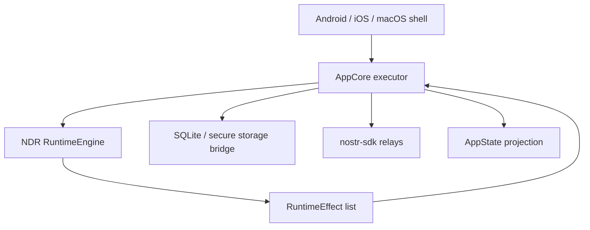

# Runtime Testability Boundary

This document tracks how the app should interact with the proposed
command/effect runtime engine in `nostr-double-ratchet`.

The library-side source of truth is
`nostr-double-ratchet/docs/TESTABILITY_IMPROVEMENTS.md`.

## App Role

`AppCore` should become the executor for runtime effects, not the owner of
protocol correctness.

The app still owns:

- native lifecycle integration
- actual relay clients
- SQLite and secure-storage bridges
- UI projection and chat-list state
- attachment, profile, mobile-push, and platform integrations

The runtime engine should own:

- protocol pending queues
- prepared publish replay rules
- missing AppKeys/invite retry state
- sender-key pending outer retry state
- desired subscription/backfill effects
- decrypted inbox emission ordering

## Mobile Tests After The Split

The mobile harness should not be the primary place where protocol race
conditions are proven. Once the runtime engine exists, mobile tests should verify
integration boundaries:

- the current build installs and launches
- app storage and secure storage are wired correctly
- runtime effects are executed by AppCore
- relay connectivity works on real platforms
- UI projections update after runtime outputs
- background/restart hooks call restore and drain effects

The hard protocol cases should move to fast Rust tests in the library:

- crash after prepared direct send
- crash after inbound decrypt
- delayed AppKeys/invites
- delayed sender-key distribution
- duplicate relay events
- out-of-order relay delivery
- group member/admin authorization
- linked-device self-sync and revocation

## App-Side Acceptance Rule

For every runtime effect batch, AppCore should eventually be able to answer:

1. Which effects were persisted?
2. Which effects were executed against relays?
3. Which decrypted inbox ids were projected into app state?
4. Which publish acks were fed back to runtime?

If those questions cannot be answered from logs or tests, the boundary is still
too implicit.
