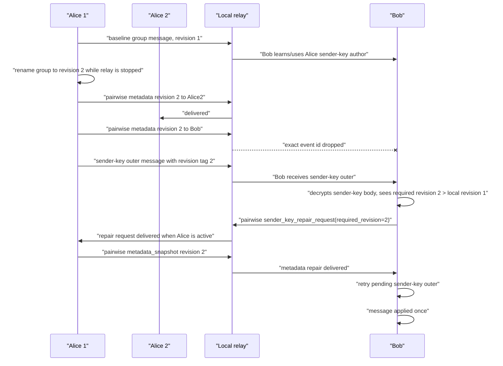
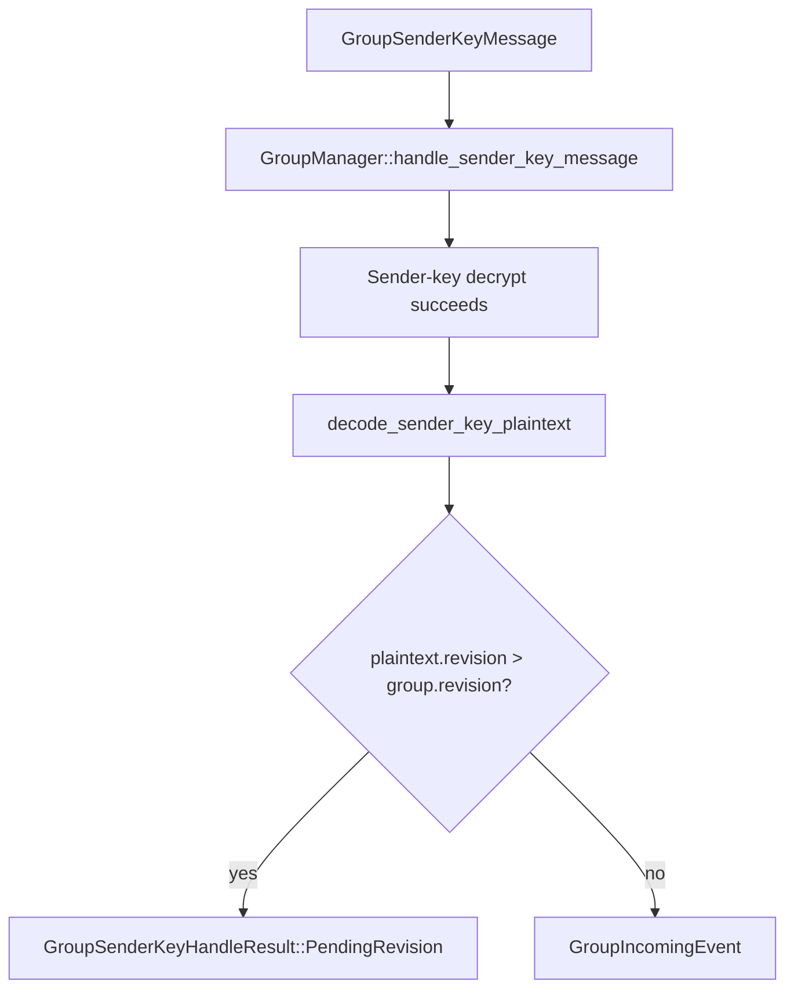
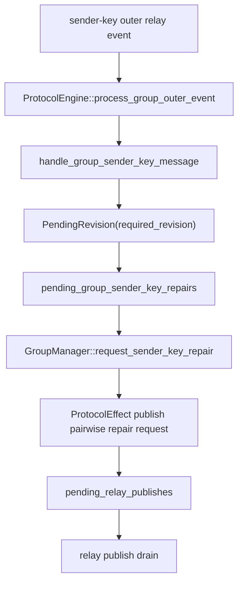

# Sender-Key Revision Repair Reproduction

This document captures the reproducible local-relay flow for proving that a sender-key group metadata revision repair request is emitted and can recover a pending group message.

The reproduction intentionally logs protocol plaintext before the pairwise/session encryption step. That logging is sensitive and must stay opt-in. It is enabled only by passing `protocol_plaintext_log_file=...` through the mobile harness, which maps to `IRIS_IOS_HARNESS_PROTOCOL_PLAINTEXT_LOG_FILE`.

## Reproduction Entry Point

Use the existing three-iOS-simulator scenario:

```bash
cd /Users/l/Projects/iris/group-hardening/iris-chat-rs

# Optional if the scenario does not already exist.
scripts/mobile_scenario.py \
  --config scripts/scenarios/alice_alice2_bob_group.json \
  setup

# Full repro. This sends a baseline message first.
scripts/reproduce_sender_key_revision_repair.py \
  --config scripts/scenarios/alice_alice2_bob_group.json

# Faster rerun when Bob already knows Alice's sender-key author.
scripts/reproduce_sender_key_revision_repair.py \
  --config scripts/scenarios/alice_alice2_bob_group.json \
  --skip-baseline
```

The script writes artifacts into the scenario work dir:

```text
/tmp/iris-mobile-scenario-alice-alice2-bob-group/
```

Important artifact patterns:

- `protocol-plaintext-revision-<stamp>.log`: plaintext protocol log.
- `revision-repair-drop-id-<stamp>.txt`: exact event id dropped by the local relay.
- `revision-repair-bob-pending-before-drop-<stamp>.json`: pending Alice-to-Bob pairwise row selected for the drop.
- `revision-repair-bob-passive-wait-message.log`: passive Bob wait.
- `revision-repair-alice-activate-after-passive-timeout.log`: sender-side activation after passive timeout.
- `revision-repair-bob-forced-wait-message.log`: successful wait after forced activation.
- `revision-repair-summary-<stamp>.json`: machine-readable outcome summary.

## Validated Run

Latest validated run:

```json
{
  "dropped_event_id": "03ca1b65fddcd81fffff62d15aa0d68fa1444a0768d90a22e8d1dfda480825e7",
  "forced_success": true,
  "group_id": "13f10e82649f2ede2eb6f248b640da38",
  "metadata_snapshot_count": 27,
  "new_name": "Revision Repair 171528",
  "passive_success": false,
  "repair_message": "revision-repair-message-171528",
  "repair_request_count": 7
}
```

The important plaintext line is the receiver-side repair request:

```json
{
  "type": "sender_key_repair_request",
  "required_revision": 2,
  "key_id": 2764261669,
  "message_number": 3,
  "sender_event_pubkey": "90486e69d2a7640d6dd6e0c4c220bb90042be0a7ad27888fb0a6d4b7c319a59b"
}
```

## Flow



## Library-Side Logic

The library detects the revision gap after decrypting the sender-key outer:



Relevant code:

- `/Users/l/Projects/iris/group-hardening/nostr-double-ratchet/rust/crates/nostr-double-ratchet/src/group_manager.rs`
  - `handle_sender_key_message(...)`
  - If the decrypted plaintext revision is newer than local metadata, returns `PendingRevision`.
  - `respond_to_sender_key_repair_request(...)`
  - If the requester is a current member and the local group revision satisfies the requested revision, sends a metadata snapshot over pairwise session.

## AppCore Logic

AppCore turns the library `PendingRevision` result into durable repair work and pairwise publish effects:



Relevant code:

- `/Users/l/Projects/iris/group-hardening/iris-chat-rs/core/src/core/protocol_engine.rs`
  - `handle_group_sender_key_message(...)`
  - Builds `SenderKeyRepairRequest { required_revision: Some(required_revision), ... }`.
  - `sender_key_repair_request_effects(...)`
  - Stores/throttles the pending repair request and prepares pairwise publish effects.
  - `sender_key_repair_response_effects(...)`
  - Handles the sender side when a repair request arrives and prepares metadata/distribution response effects.

## Liveness Wrinkle

The protocol repair path worked, but the passive mobile-harness wait did not converge by itself.

There were two separate causes:

1. The scenario relay URL in existing app state was stale.
   - Some devices still had `ws://192.168.1.6:4848`.
   - The host had moved to `192.168.100.4`.
   - Simulators could reach the local relay reliably through `ws://127.0.0.1:4848`.
   - The repro script now adds `ws://127.0.0.1:<port>` to Alice1, Alice2, and Bob, then waits for each device to report at least one connected relay.

2. The iOS harness is action-scoped, not a continuously running multi-device system.
   - `xcodebuild test-without-building` launches the app test host for one harness action.
   - After Alice renames the group offline, Alice's pending pairwise metadata rows do not necessarily publish unless Alice is active after the relay restart.
   - After Bob receives the revision-2 sender-key outer, Bob can create and publish repair requests, but Alice must also be active to receive and answer them.
   - The passive Bob wait exercises only Bob. It proved Bob emits repair requests, but it did not keep Alice's protocol loop alive to answer.
   - Once the script activates Alice and waits for connected relay state, Alice processes Bob's repair request, emits metadata snapshots, and Bob applies the pending message.

This is why the validated run had:

```json
{
  "passive_success": false,
  "forced_success": true,
  "repair_request_count": 7
}
```

## What This Means

The revision repair protocol is functional:

- Bob receives a sender-key outer.
- Bob decrypts enough to discover that the message requires metadata revision 2.
- Bob emits pairwise `sender_key_repair_request(required_revision=2)`.
- Alice answers with a metadata snapshot.
- Bob retries the pending outer and applies the message.

The passive harness timeout is not evidence that revision repair is logically broken. It is evidence that this manual harness does not keep both sides' AppCore event loops alive. A product device that is foregrounded and connected should answer repair requests. A suspended/offline sender cannot answer until it reconnects, so recovery latency depends on sender-side app liveness.

## Open Product Risk

The remaining product question is background behavior: if the sender is suspended, a receiver can request repair but cannot force the sender to answer immediately. That is expected for a client-side encrypted protocol over relays, but it means group repair is only as fast as sender-side app wake/connect behavior.

If we want stronger recovery latency, the options are:

- keep foreground/liveness processing active while the app is open;
- use push/background execution to wake the sender for repair requests where platforms allow it;
- periodically retry pending repair requests from receivers;
- keep repair requests durable, so they are answered when the sender next starts.
