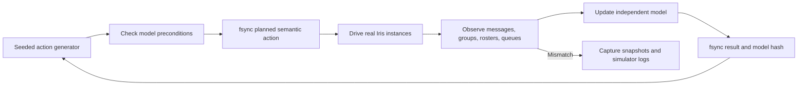

# Stateful model-based soak testing

`scripts/stateful_soak.py` runs long, reproducible user journeys against real
Iris app instances. An independent in-memory model decides which actions are
valid, records the intended action before touching the apps, executes it, and
then compares Iris with the expected state.

This first backend is deliberately a deep native-iOS test rather than a large
synthetic fleet: three users run on four isolated simulators, including a
linked second device for Alice. It exercises the real UI harness, persistence,
protocol engine, and relay traffic. A future headless backend can reuse the
model and journal when hundreds of users are needed.



## What it covers

- link and revoke a second device;
- direct messages from any active device;
- send while a recipient is offline, restart it, and verify relay catch-up;
- create a group, send messages, add/remove members, rename it, and change
  administrators;
- restart devices while the model continues;
- audit runtime and persisted protocol snapshots, zero pending queues, latest
  direct and group messages, group shape, and authorized-device rosters.

The generator first covers each eligible action once, then selects weighted
random actions. A seed makes the semantic sequence deterministic. Actions are
only generated when their model preconditions hold.

Before the semantic sequence starts, every primary app must connect to at
least one configured relay. Failure at this gate is reported as setup or
infrastructure failure, with no model action counted and with the same state
and system-log capture used for action failures.

## Run it

The iOS build needs a Rust toolchain accepted by the current dependency graph
and the `aarch64-apple-ios` and `aarch64-apple-ios-sim` targets. Select such a
toolchain with `RUSTUP_TOOLCHAIN` when the repository default is older.

```bash
RUSTUP_TOOLCHAIN=1.97.0-aarch64-apple-darwin \
  python3 scripts/stateful_soak.py run \
  --profile ios-local \
  --duration 10m \
  --seed 20260721
```

Useful controls:

- `--max-actions 20` adds a deterministic upper bound;
- `--audit-every 10` runs a full invariant audit periodically;
- `--skip-build` reuses existing iOS and relay builds;
- `--profile ios-public` uses the five disposable public-relay defaults;
- `--public-relays wss://...,...` overrides that relay set;
- `--keep-devices-open` preserves visible simulators after cleanup.

`--duration` controls how long the runner may schedule new generated actions;
it is not a destructive wall-clock timeout. An action already in flight and
the mandatory final audit are allowed to finish, so the overall runtime can be
longer. Use `--max-actions` as an additional bound for quick smoke runs.

Public-relay runs create disposable identities and uniquely marked events that
may remain on those relays. Do not use account keys belonging to a person.

## Replay a failure

Replay consumes the planned semantic actions, including an action whose
process died before it could write a result. It creates fresh identities and a
new artifact directory. By default it inherits the source journal's local or
public relay profile; pass `--profile` to override the environment explicitly.

```bash
RUSTUP_TOOLCHAIN=1.97.0-aarch64-apple-darwin \
  python3 scripts/stateful_soak.py replay \
  artifacts/stateful-soak/RUN/actions.jsonl \
  --skip-build
```

## Debugging artifacts

Each run creates a mode-`0700` directory under
`artifacts/stateful-soak/<timestamp>-seed-<seed>/`:

| File | Purpose |
| --- | --- |
| `summary.json` | Pass/fail, classification, timing, action counts, and paths |
| `run.json` | Command, seed, profile, tool/Git state, simulators, host relay probes |
| `actions.jsonl` | Append-only semantic and low-level journal, fsynced per record |
| `model.json` | Last successfully observed expected world state |
| `console.log` | Complete redacted runner and tool output |
| `scenario/state.json` | Harness identities, device IDs, chats, and relay state |
| `scenario/harness-actions/` | One log for each low-level harness call |
| `scenario/relay.log` | Local relay output when using `ios-local` |
| `failure/` | Error, model-at-failure, runtime/persisted snapshots, system logs |
| `artifact-index.json` | Byte length and SHA-256 of every evidence file |

The journal writes `semantic_action_planned` before execution and
`semantic_action_finished` afterward. Their model hashes distinguish an action
that never began, one that partially mutated state, and an observation failure.
Secrets, nsec values, invite/device-link inputs, and device-approval URIs are
redacted before being written to the journal, console, harness logs, or failure
captures.

Start triage with `summary.json`, find the last planned and finished semantic
actions in `actions.jsonl`, then inspect the matching numbered harness logs and
`failure/captured-state.json`. Use `artifact-index.json` to detect missing or
changed evidence when sharing a bundle.

## Current boundary

This backend gives strong vertical coverage of real native app behavior, but
four simulators are not a load test. Congestion, hundreds of identities, relay
partitions, and statistically broad schedules belong in a second headless
executor that consumes the same `Action`, `WorldModel`, and JSONL format. That
keeps native release confidence and high-scale protocol stress distinct while
making failures replayable across both.
